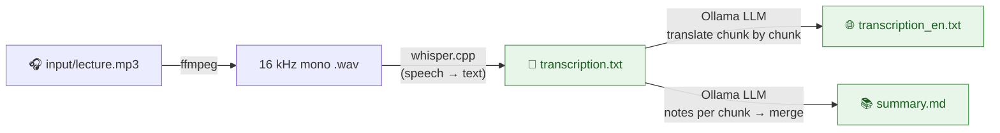
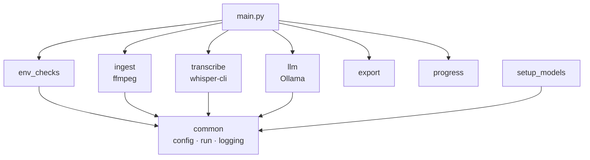

# 🎙️ Local AI Transcriber

> [!NOTE]
> **About how this was built:** The workflow was designed by the author: the pipeline stages, the choice of local models and how each step should behave. The code itself was written with AI assistance. Please review it before relying on it for anything critical.

> Put lecture recordings in a folder and get back a transcript, an English translation and study notes. Everything runs on your laptop, with no cloud and no internet once setup is done.

Built for long university lectures and conference talks, especially **Mandarin lectures** you want to read in English. Each recording becomes three files:

| File | What's inside |
|------|---------------|
| 📝 `transcription.txt` | Word-for-word transcript in the spoken language |
| 🌐 `transcription_en.txt` | Faithful English translation |
| 📚 `summary.md` | Study summary: overview, one section per topic, key terms, takeaways |

---

## 🧭 The journey of a recording



Two local engines do the work:

- **[whisper.cpp](https://github.com/ggerganov/whisper.cpp)** (`large-v3-turbo`) listens to the audio and writes down what was said. It is GPU-accelerated on Apple Silicon.
- **[Ollama](https://ollama.com)** (`gemma4:31b-mlx` by default) reads the transcript, translates it and writes the summary.

Each file is saved **as soon as its stage finishes**. If the summary step fails, you still keep the transcript. If one recording fails, the rest of the batch still runs.

---

## 🧰 What you'll need

| Tool | Why | Install |
|------|-----|---------|
| macOS on Apple Silicon | Metal GPU makes whisper and the LLM fast. Intel or Linux works, but slower. | — |
| [Homebrew](https://brew.sh) | Installs everything below | see website |
| `ffmpeg` | Converts any audio format to what whisper expects | `brew install ffmpeg` |
| `whisper-cpp` | Speech-to-text engine (`whisper-cli`) | `brew install whisper-cpp` |
| [Ollama](https://ollama.com) | Runs the local LLM. The app or daemon must be running. | `brew install ollama` |
| Python ≥ 3.10 + [Poetry](https://python-poetry.org) 2.x | Runs the pipeline | `brew install poetry` |

**Disk and memory:** the whisper model is ~1.6 GB. The default 31B LLM is a large download and needs a lot of RAM. On a smaller machine, pick a lighter model (see [Swap the LLM](#-swap-the-llm)).

---

## 🚀 Up and running in 4 steps

Setup is a one-time step that needs internet. After that, everything runs offline.

```bash
# 1. Install the system tools
brew install ffmpeg whisper-cpp ollama

# 2. Install the Python project
poetry install

# 3. Check that your machine is ready (prints OK / WARN / FAIL with a fix for each)
poetry run python -m scripts.env_checks

# 4. Download the models (whisper file → models/, and `ollama pull` for the LLM)
poetry run python -m scripts.setup_models
```

Then drop your recordings (`.m4a`, `.mp3`, `.wav`, `.aac`, `.flac`, `.ogg`, `.wma`) into `input/` and run:

```bash
poetry run python main.py
```

You'll see a live progress line for each stage:

```
[1/2] lecture.m4a · whisper (audio 1:12:05)   elapsed 3:41
[1/2] lecture.m4a · translate → English        elapsed 1:24  (3/7 chunks)
```

Results go to `output/<recording name>/`.

---

## 🎛️ Everyday commands

| I want to… | Run |
|------------|-----|
| Process everything in `input/` | `poetry run python main.py` |
| Process specific files only | `poetry run python main.py path/to/a.m4a path/to/b.mp3` |
| Redo files that already have output | `poetry run python main.py --overwrite` |
| Transcribe an **English** lecture (no translation) | `poetry run python main.py --language en talk.mp3` |
| Transcribe a **Mandarin** lecture (default) | `poetry run python main.py --language zh` |
| Keep Ollama loaded after the run | `poetry run python main.py --shutdown none` |
| Fully stop Ollama after the run | `poetry run python main.py --shutdown daemon` |
| Use a different config file | `poetry run python main.py --config my-config.yaml` |

By default, recordings that already have all three outputs are **skipped**, so re-running after adding new files is cheap. When the run ends, the LLM is unloaded from memory (`--shutdown model`).

---

## 🔧 Make it yours: `config.yaml`

`config.yaml` is the only file you need to edit.

### 🧠 Swap the LLM

Any chat model from the [Ollama library](https://ollama.com/library) works.

1. Pull it:
   ```bash
   ollama pull qwen3:8b
   ```
2. Point the config at it:
   ```yaml
   llm:
     model: qwen3:8b
   ```
3. Run as usual.

Things to keep in mind:

- **`num_ctx`** (default `16384`) is how much text the model can read at once. Keep it larger than one chunk plus the prompt.
- **`num_predict`** (default `4096`) caps the length of each reply. If you see `⚠ LLM output hit the num_predict limit`, raise this or lower `chunk_tokens`.
- **`temperature`** (default `0.2`) stays low on purpose, because translations should be faithful rather than creative.
- **`base_url`** lets you point at an Ollama server on another port or machine.

### 👂 Swap the Whisper model

whisper.cpp models live on [Hugging Face](https://huggingface.co/ggerganov/whisper.cpp/tree/main). Pick one, then update **both** lines:

```yaml
stt:
  model_url: https://huggingface.co/ggerganov/whisper.cpp/resolve/main/ggml-large-v3-turbo-q5_0.bin
  model_filename: ggml-large-v3-turbo-q5_0.bin
```

Then download it:

```bash
poetry run python -m scripts.setup_models
```

| Model file | Size | Trade-off |
|------------|------|-----------|
| `ggml-large-v3-turbo.bin` *(default)* | ~1.6 GB | Best balance of accuracy and speed |
| `ggml-large-v3-turbo-q5_0.bin` | ~0.55 GB | Quantized: smaller and faster, with a small accuracy cost |
| `ggml-large-v3.bin` | ~3.1 GB | Most accurate, noticeably slower |
| `ggml-medium.bin` / `ggml-small.bin` | ~1.5 / 0.5 GB | Lighter machines. Weaker on Mandarin. |

### 🗣️ Other knobs

| Setting | Default | What it does |
|---------|---------|--------------|
| `stt.language` | `zh` | Language spoken in the recording. `en` skips translation. Avoid `auto`, because whisper often mistakes Mandarin lectures for English. |
| `chunk_tokens` | `3000` | Size of each piece sent to the LLM (~4,500 Chinese characters) |
| `overlap_sentences` | `1` | Sentences repeated between chunks so translations join smoothly |
| `prompts.*` | — | The exact instructions given to the LLM for translation and summary. Tune them freely. |
| `enable_denoise` | `false` | Noise reduction for noisy recordings. Needs `poetry install --with denoise`. |

---

## 🗂️ What's in the box

```
transcriptionAI/
├── config.yaml          ← the one file you edit
├── main.py              ← run this: loops over recordings, runs each stage
├── scripts/
│   ├── env_checks.py    ← "is my machine ready?" (CLI + used by main.py)
│   ├── setup_models.py  ← one-time model downloads
│   ├── common.py        ← config loading, shell commands, logging
│   ├── ingest.py        ← ffmpeg → wav (+ optional denoise)
│   ├── transcribe.py    ← whisper-cli → timed segments
│   ├── llm.py           ← Ollama client, chunking, translate, summarize
│   ├── export.py        ← writes each output file
│   ├── progress.py      ← live timers, chunk counter, ⚠ warnings
│   └── README.md        ← 🔬 deep dive into how each piece works
├── tests/               ← fast unit tests (no models needed)
├── input/               ← 🎧 your recordings go here       (git-ignored)
├── output/              ← 📄 results appear here           (git-ignored)
└── models/              ← whisper model file               (git-ignored)
```

How the pieces connect:



For the full tour, including chunking, map-reduce summaries and the safeguard that stops the LLM from repeating itself in loops, see **[`scripts/README.md`](scripts/README.md)**.

---

## ✅ Running the tests

```bash
poetry run pytest -q
```

The test suite stubs out whisper, ffmpeg and Ollama, so it runs in **under a second** with no models installed. 28 tests cover:

| File | Covers |
|------|--------|
| `test_llm.py` | Chunking, translation rejoin, map-reduce summary, loop detection and retry, output-limit warnings |
| `test_main.py` | Course language: Mandarin translates, English skips, `--language` overrides config |
| `test_export.py` | Output folders, transcript ordering, the "already done" check |
| `test_transcribe.py` | whisper is called with the anti-repetition flag (`-mc 0`) |
| `test_progress.py` | Terminal timer and warnings |

Run a single file or test:

```bash
poetry run pytest tests/test_llm.py -v
poetry run pytest -k loop -v
```

---

## 🩺 When something goes wrong

| You see | Try |
|---------|-----|
| `Command not found: ffmpeg` / `whisper-cli` | `brew install ffmpeg whisper-cpp` |
| `STT model missing` | `poetry run python -m scripts.setup_models` |
| `LLM model '…' not present` | `ollama pull <model>` |
| Ollama server down | Start the Ollama app, or run `ollama serve` |
| Mandarin lecture came out as English gibberish | Use `--language zh` (or set `stt.language: zh`) |
| `⚠ LLM loop detected` | Handled automatically (reload and retry). If it keeps happening, check the transcript itself. |
| `⚠ … hit the num_predict limit` | Lower `chunk_tokens` or raise `llm.num_predict` |

For more, run `poetry run python -m scripts.env_checks` or see the [troubleshooting table](scripts/README.md#8-troubleshooting-quick-guide).
