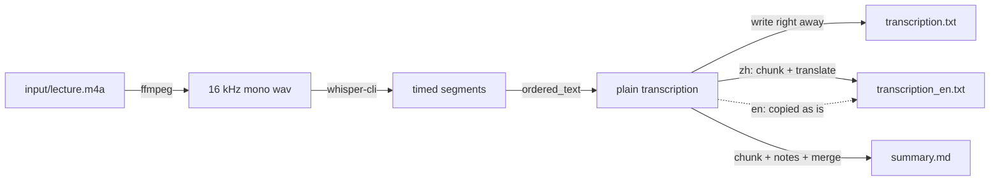
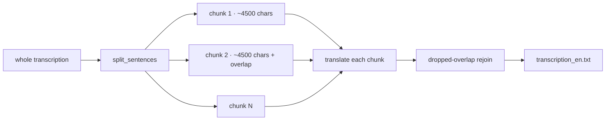

# scripts/ — how the pipeline is built

A plain-English tour of each piece that turns a lecture recording into
three text files — all on your machine, no internet.

The files imported as a package (`from scripts import ...`). Run with the
project's virtual environment:

```bash
poetry run python main.py input/my-lecture.m4a
```

---

## 1. The big picture



Each output file is written as soon as its stage finishes. The course
language comes from `stt.language` in `config.yaml` (default `zh`) or the
`--language` flag; for English courses (`en`) the translation step is skipped.

The `main.py` orchestrator runs these steps per file, wrapped in a
`progress.StageTimer` so you always see what is running and how long it
took.

---

## 2. Modules

| Module | Job | Key functions |
|--------|-----|---------------|
| `common.py` | Shared plumbing: config, paths, subprocess, logging | `load_config`, `resolve_model_path`, `run`, `which` |
| `env_checks.py` | Verify the machine is ready (tools + models) | `check_env` |
| `setup_models.py` | Download what is missing (whisper model, ollama pull) | `ensure_model` |
| `ingest.py` | Audio → 16 kHz mono wav, optional voice de-noise | `ingest`, `probe_duration`, `to_wav`, `denoise_wav` |
| `transcribe.py` | wav → timed segments via `whisper-cli` | `transcribe`, `parse_segments` |
| `llm.py` | Ollama client (streaming + loop safeguard), chunking, translate, map-reduce summary | `chunk_text`, `translate`, `summarize`, `OllamaClient`, `find_loop`, `has_loop` |
| `export.py` | Write each output file as its stage finishes | `write_output`, `ordered_text`, `already_done` |
| `progress.py` | Live terminal timer, chunk counter, warnings | `StageTimer`, `format_elapsed` |

---

## 3. The audio stage (`ingest.py` + `transcribe.py`)

1. **ffmpeg** converts whatever you recorded (m4a, mp3, wav, …) to a
   whisper-friendly format: 16 kHz, mono, PCM wav.
2. **whisper-cli** (whisper.cpp, model `ggml-large-v3-turbo.bin`) turns the
   wav into timed segments. It runs fully offline, with two important flags:
   - `-l zh` / `-l en` — the course language. Don't rely on auto-detect:
     it hears Mandarin lectures as English and writes a garbled paraphrase.
   - `-mc 0` — don't feed earlier text back in as context. Without it whisper
     can get stuck repeating one line for the rest of the recording.
3. Each segment has a start time, end time, and recognised text — written to
   a JSON output file that `parse_segments` reads back into Python objects.

```python
# main.py reads the audio length up front so the whisper stage can
# tell you how long the source is before it starts (per-file progress).
audio_duration = ingest_mod.probe_duration(audio_path)
with StageTimer(f"[{file_index}/{file_total}] {name} · whisper (audio {format_elapsed(audio_duration)})"):
    segments = transcribe_mod.transcribe(wav_path, model_path, language=stt["language"])
```

### Why not a percentage bar for whisper?

whisper-cli does not expose a parseable progress percentage that survives
its output stream, so a numeric bar here would be guesswork. Instead we show
an honest elapsed `mm:ss` timer. On the LLM stages the chunk count **is**
known up front, so those show real progress like `(chunk 3/7)`.

---

## 4. The language stage (`llm.py`)

The transcription can be hours long, but the local model has a context
window. So text is split into sentences, then into chunks:



- `chunk_text(text, max_chars, overlap_sentences)` walks the sentence list,
  packing sentences until the size limit, and repeats the last `overlap`
  sentences at the start of the next chunk so nothing is lost across the cut.
- The **translation** passes each chunk to Ollama; after the first chunk,
  the overlapped sentences are dropped from the front of each reply before
  rejoining, so neighbouring chunks chain cleanly.
- The **summary** is *map-reduce*: every chunk is turned into detailed study
  notes (`chunk_prompt`), then all notes (separated by `---`) are handed to
  one final call (`all_prompt`) that writes a comprehensive summary: overview,
  one section per topic in prose, key terms, key takeaways.
- For English courses the translation step is skipped entirely; the summary
  still runs.

```python
def translate(client, model, prompt, chunks, overlap_sentences, options,
              on_progress=None, on_warning=None):
    parts = []
    for chunk_number, (chunk_start, chunk_end, chunk) in enumerate(chunks):
        if on_progress:
            on_progress(chunk_number + 1, len(chunks))    # drive the terminal counter
        out = client.chat(model, prompt, chunk, options=options, on_warning=on_warning,
                          label=f"translate chunk {chunk_number + 1}/{len(chunks)}")
        ...
```

Every chunk uses the same model; loop retries happen inside `chat` (see
below). The number of chunks you see in the terminal counter equals `len(chunks)`.

### The Ollama client

`OllamaClient` talks to the local server through plain HTTP (`/api/chat`) —
no SDK needed. `chat(model, system, user, options, on_warning, label)` posts
one system prompt and one user message and **streams** the reply back.
It sends `"think": false`: thinking models such as gemma4 otherwise spend
most of `num_predict` on hidden reasoning and the visible translation gets
cut off. If Ollama still stops at the limit (`done_reason: length`), a `⚠`
warning names the chunk.
`unload(model)` drops the model from memory (`keep_alive: 0`); the next
request loads it fresh.

### Loop safeguard

LLMs sometimes degenerate into repeating the same phrase until they hit the
token limit. Because the reply is streamed, `chat` checks it every ~200
characters:

1. `find_loop(text)` — does the reply *end* in a unit repeated 5+ times
   spanning 200+ characters? Normal text like "……" or "哈哈哈" doesn't count.
2. If it loops, the stream is closed (Ollama stops generating), the model is
   unloaded, and the chunk is retried with temperature +0.2 — at most 2 times.
3. If it still loops, the reply is cut where the loop starts and the run
   carries on.
4. `has_loop(source)` — if the *input* chunk itself repeats (a broken
   transcript), retrying can't help: the reply is cut right away, no reload.

Every reset prints a warning on its own line, e.g.

```
  ⚠ LLM loop detected (translate chunk 2/3) — model reloaded, retrying (1/2)
```

---

## 5. Writing outputs (`export.py`)

| File | Content |
|------|---------|
| `transcription.txt` | Original language, one line per segment — written right after whisper |
| `transcription_en.txt` | English translation (English courses: the transcript itself) |
| `summary.md` | Comprehensive Markdown summary (map-reduce) |

`write_output(output_dir, name, key, text)` creates `output/<name>/` and
writes one file, so `main.py` saves each result as soon as its stage
finishes — the transcript survives even if a later LLM stage fails.

`already_done(output_dir, name)` returns `True` when all three files already
exist — that's what lets `main.py` skip finished lectures by default
(`--overwrite` reprocesses them).

---

## 6. Progress in the terminal (`progress.py`)

Each stage is wrapped in a `StageTimer` context manager:

```python
with StageTimer("translate → English") as stage:
    translation = llm_mod.translate(..., on_progress=stage.set_progress)
```

On a real terminal you see a live line that refreshes in place:

```
[1/2] koala.m4a · translate → English  elapsed 1:24  (3/7 chunks)
```

When the stage ends the line is erased and replaced with a clean summary:

```
[1/2] koala.m4a · translate → English  done in 1:41
```

When stderr is **not** a terminal (logs, `| tee`, CI) the timer is disabled
and each stage prints just its `running…` / `done in mm:ss` lines.

`stage.warn(message)` prints a `⚠` line without garbling the live timer;
the loop safeguard uses it through `on_warning=stage.warn`.

---

## 7. Environment checks (`env_checks.py` + `setup_models.py`)

`main.py` preflights before doing any work:

- `check_env()` verifies brew, ffmpeg, whisper-cli, the ollama daemon, the
  LLM model, and the whisper model — one line and one fix hint per check.
- If something is missing, `python -m scripts.setup_models` downloads just
  the missing pieces (whisper model file, `ollama pull gemma4:31b-mlx`).

### Cleaning up after a run

By default `main.py` frees the LLM from RAM when it finishes
(`ollama stop gemma4:31b-mlx`). Control it with `--shutdown`:

| Flag | Effect |
|------|--------|
| `--shutdown model` (default) | Unload the LLM from RAM; the Ollama daemon stays up for other tools |
| `--shutdown daemon` | Also `brew services stop ollama` — everything fully down |
| `--shutdown none` | Leave the model + daemon exactly as they were |

### Course language

| Flag | Effect |
|------|--------|
| `--language zh` | Mandarin course: Chinese transcript, translated to English (the `config.yaml` default) |
| `--language en` | English course: English transcript, translation skipped |
| `--language auto` | Let whisper guess — not recommended for Mandarin lectures |

Without the flag, `stt.language` from `config.yaml` is used.

---

## 8. Troubleshooting quick guide

| Symptom | Fix |
|---------|-----|
| `Command not found: ffmpeg` | `brew install ffmpeg` |
| `Command not found: whisper-cli` | `brew install whisper-cpp` |
| STT model missing | `poetry run python -m scripts.setup_models` |
| `gemma4:31b-mlx` not present | `ollama pull gemma4:31b-mlx` (via `scripts.setup_models`) |
| Ollama server down | start it (`ollama serve`) — `check_env` will say so |
| A stage shows `failed` | read the `common.run` line above it: it logs the exact command |
| Translation starts mid-sentence | larger `chunk_tokens` in `config.yaml` or more `overlap_sentences` |
| Transcript is English gibberish for a Mandarin lecture | run with `--language zh` (or set `stt.language: zh`) |
| Transcript repeats one line over and over | whisper already runs with `-mc 0`; check the language setting first |
| `⚠ LLM loop detected` | handled automatically (reload + retry); if it keeps happening, check the transcript for repetition |
| `⚠ LLM output hit the num_predict limit` | lower `chunk_tokens` or raise `llm.num_predict` in `config.yaml` |
| Translation much shorter than the transcript | check for the warning above; chunks are sized at ~1.5 Chinese chars per token (`CHARS_PER_TOKEN`) |

---

## 9. Tests

```bash
poetry run pytest -q
```

The tests in `tests/` cover chunking, loop detection and retry, output
writing, the `--language` flag and the progress output. Ollama, whisper and
ffmpeg are stubbed, so they run in well under a second.