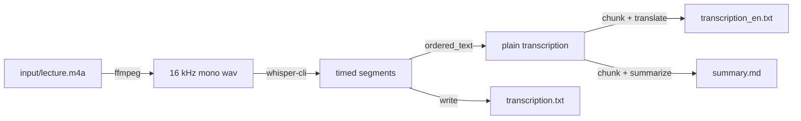
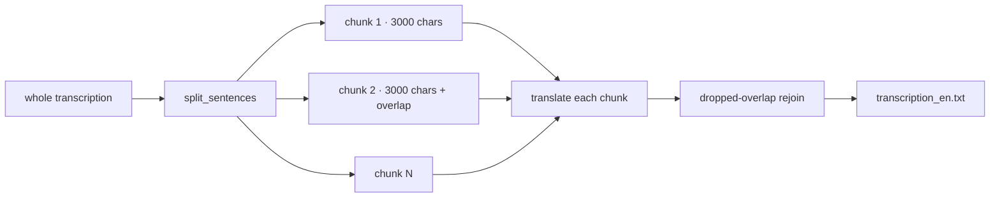

# scripts/ — how the pipeline is built

A plain-English tour of each piece that turns a lecture recording into
three text files — all on your machine, no internet.

The files imported as a package (`from scripts import ...`). Run with the
project's virtual environment:

```bash
poetry run python main.py input/my-lecture.m4a
```

---

## 1. The big picture



The `main.py` orchestrator runs these steps per file, wrapped in a
`progress.StageTimer` so you always see what is running and how long it
took.

---

## 2. Modules

| Module | Job | Key functions |
|--------|-----|---------------|
| `common.py` | Shared plumbing: config, paths, subprocess, logging | `load_config`, `resolve_model_path`, `run`, `which` |
| `env_checks.py` | Verify the machine is ready (tools + models) | `check_env` |
| `setup_models.py` | Download what is missing (whisper model, ollama pull) | `ensure_model` |
| `ingest.py` | Audio → 16 kHz mono wav, optional voice de-noise | `ingest`, `probe_duration`, `to_wav`, `denoise_wav` |
| `transcribe.py` | wav → timed segments via `whisper-cli` | `transcribe`, `parse_segments` |
| `llm.py` | Ollama client, chunking, translate, map-reduce summary | `chunk_text`, `translate`, `summarize`, `OllamaClient` |
| `export.py` | Write the three output files | `export`, `ordered_text`, `already_done` |
| `progress.py` | Live terminal timer + chunk counter per stage | `StageTimer`, `format_elapsed` |

---

## 3. The audio stage (`ingest.py` + `transcribe.py`)

1. **ffmpeg** converts whatever you recorded (m4a, mp3, wav, …) to a
   whisper-friendly format: 16 kHz, mono, PCM wav.
2. **whisper-cli** (whisper.cpp, model `ggml-large-v3-turbo.bin`) turns the
   wav into timed segments. It runs fully offline.
3. Each segment has a start time, end time, and recognised text — written to
   a JSON output file that `parse_segments` reads back into Python objects.

```python
# main.py reads the audio length up front so the whisper stage can
# tell you how long the source is before it starts (per-file progress).
audio_duration = ingest_mod.probe_duration(audio_path)
with StageTimer(f"[{file_index}/{file_total}] {name} · whisper (audio {format_elapsed(audio_duration)})"):
    segments = transcribe_mod.transcribe(wav_path, model_path)
```

### Why not a percentage bar for whisper?

whisper-cli does not expose a parseable progress percentage that survives
its output stream, so a numeric bar here would be guesswork. Instead we show
an honest elapsed `mm:ss` timer. On the LLM stages the chunk count **is**
known up front, so those show real progress like `(chunk 3/7)`.

---

## 4. The language stage (`llm.py`)

The transcription can be hours long, but the local model has a context
window. So text is split into sentences, then into chunks:



- `chunk_text(text, max_chars, overlap_sentences)` walks the sentence list,
  packing sentences until the size limit, and repeats the last `overlap`
  sentences at the start of the next chunk so nothing is lost across the cut.
- The **translation** passes each chunk to Ollama; after the first chunk,
  the overlapped sentences are dropped from the front of each reply before
  rejoining, so neighbouring chunks chain cleanly.
- The **summary** is *map-reduce*: every chunk is summarised into bullets
  (`chunk_prompt`), then all bullets are handed to one final call
  (`all_prompt`) that distills the whole lecture.

```python
def translate(client, model, prompt, chunks, overlap_sentences, options, on_progress=None):
    parts = []
    for chunk_number, (chunk_start, chunk_end, chunk) in enumerate(chunks):
        if on_progress:
            on_progress(chunk_number + 1, len(chunks))    # drive the terminal counter
        out = client.chat(model, prompt, chunk, options=options)
        ...
```

Every chunk shares the pet model, so failures retry via the caller; the
number of chunks you see in the terminal counter equals `len(chunks)`.

### The Ollama client

`OllamaClient` talks to the local server through plain HTTP (`/api/chat`) —
no SDK needed. `chat(model, system, user, options)` posts one system prompt
and one user message and returns the text reply.

---

## 5. Writing outputs (`export.py`)

| File | Content |
|------|---------|
| `transcription.txt` | Original language, one blank line between segments |
| `transcription_en.txt` | English translation |
| `summary.md` | Markdown structure + map-reduce summary |

`already_done(output_dir, name)` returns `True` when all three files already
exist — that's what lets `main.py` skip finished lectures by default
(`--overwrite` reprocesses them).

---

## 6. Progress in the terminal (`progress.py`)

Each stage is wrapped in a `StageTimer` context manager:

```python
with StageTimer("translate → English") as stage:
    translation = llm_mod.translate(..., on_progress=stage.set_progress)
```

On a real terminal you see a live line that refreshes in place:

```
[1/2] koala.m4a · translate → English  elapsed 1:24  (3/7 chunks)
```

When the stage ends the line is erased and replaced with a clean summary:

```
[1/2] koala.m4a · translate → English  done in 1:41
```

When stderr is **not** a terminal (logs, `| tee`, CI) the timer is disabled
and each stage prints just its `running…` / `done in mm:ss` lines.

---

## 7. Environment checks (`env_checks.py` + `setup_models.py`)

`main.py` preflights before doing any work:

- `check_env()` verifies brew, ffmpeg, whisper-cli, the ollama daemon, the
  LLM model, and the whisper model — one line and one fix hint per check.
- If something is missing, `python -m scripts.setup_models` downloads just
  the missing pieces (whisper model file, `ollama pull qwen3:14b`).

---

## 8. Troubleshooting quick guide

| Symptom | Fix |
|---------|-----|
| `Command not found: ffmpeg` | `brew install ffmpeg` |
| `Command not found: whisper-cli` | `brew install whisper-cpp` |
| STT model missing | `poetry run python -m scripts.setup_models` |
| `qwen3:14b` not present | `ollama pull qwen3:14b` (via `scripts.setup_models`) |
| Ollama server down | start it (`ollama serve`) — `check_env` will say so |
| A stage shows `failed` | read the `common.run` line above it: it logs the exact command |
| Translation starts mid-sentence | larger `chunk_tokens` in `config.yaml` or more `overlap_sentences` |